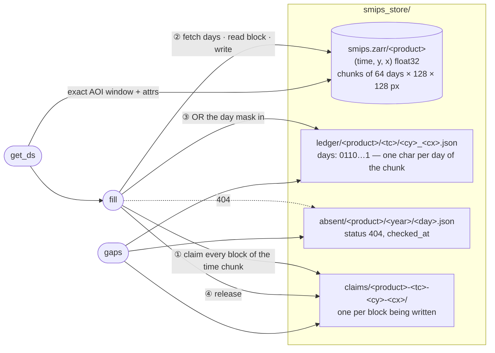
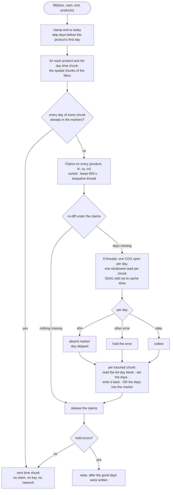

# pysmips

**Cached [SMIPS](https://www.tern.org.au/) daily soil-moisture cubes for
Australia — download once per pixel-day, never twice.** The Soil
Moisture Integration and Prediction System (CSIRO/TERN) publishes a
national ~1 km daily soil-water product as one Cloud-Optimised GeoTIFF
per product per day on the TERN datastore. Every pixel-day this machine
ever downloads lands in one sparse, chunk-indexed store, so repeat
requests, overlapping AOIs, extended date ranges and new products reuse
everything already fetched. Part of the
[Borevitz Lab](https://biology.anu.edu.au/research/research-groups/borevitz-group-plant-genomics-climate-adaption) ecosystem.

## How it works

```
{tmp_dir}/smips_store/
├── smips.zarr/
│   ├── totalbucket   # one sparse (time, y, x) array per product
│   └── smindex ...
├── ledger/           # one JSON marker per written (product, time-chunk, chunk) block
│   └── totalbucket/00085/012_034.json      # {"days": "0110...1"}  one char per day
├── absent/           # upstream 404s, dated, read only by gaps()
│   └── totalbucket/2026/2026-10-04.json
└── claims/           # cross-node mutex directories, present only during a write
```

The ledger is files, not a database. This branch (`gadi`) runs as many
PBS jobs on many Gadi nodes against one store on Lustre, where file
locks are node-local and SQLite is unsafe; see
[troi/docs/ledger.md](https://github.com/thestochasticman/troi/blob/gadi/docs/ledger.md).
A marker is committed by atomic rename, and a block is written under a
claim directory so two jobs never read-modify-write the same Zarr block.

- SMIPS v1.0 sits on **one fixed grid** (4110 × 3474 px, ~0.01°,
  EPSG:4326) that has not changed since 2005-01-01, so the lattice is
  hardcoded (`pysmips.grid`). Every COG the store opens is checked
  against it; a mismatch raises instead of writing.
- Any bbox × date range maps deterministically to a set of
  (day, 128 × 128-px chunk) cells. `Store.get_ds(bbox, start, end)`
  diffs them against the ledger and downloads **only the missing
  cells**: one remote COG open per day, one integer-aligned windowed
  read per chunk — no resampling, ever. Days are fetched concurrently
  (`workers`, default 8).
- Four chunks nest in each 512 × 512 COG block, so a small AOI does not
  drag a 500 km block into the store, while adjacent chunks of one day
  share the block read.
- Reads return the **exact AOI window** (not whole chunks — a SMIPS chunk
  is ~130 km across) as an `xarray.Dataset` on `(time, lat, lon)`.
- A day the datastore does not hold (HTTP 404 — in practice the two or
  three most recent, not yet published) is simply not fetched: nothing
  is recorded, it reads as NaN, and the next fill asks again. Any other
  failure (a 401 from a stale key, a timeout, a 5xx) raises rather than
  being written into the store as silent NaN.
- Asking again costs one request per unpublished day per product, on
  every `fill`/`get_ds` whose range includes that day. A filled range
  whose days are all published is served from the ledger alone.
- The 404 is also written under `absent/` with the time it was seen, so
  `gaps()` can say *why* a day is empty. That record never suppresses a
  fetch. `fill` clamps `end` to today, so no request is made for the future.
- Pixel reads require a TERN API key (listings are public) — set
  `tern_api_key` in `~/.config/Troi.json`, `TROI_TERN_KEY`, or pass
  `api_key=` per call. Keys are free from <https://account.tern.org.au/>.
- Nothing is ever resampled. `get_ds` returns native pixels with the
  attrs `crs`, `transform` (six affine numbers of the returned window),
  `nodata` and `native_res_m`, so a consumer can regrid reproducibly from
  the dataset alone.

### The pieces



The unit of the ledger is one **block**: one product, one 64-day time
chunk, one 128 × 128 px spatial chunk. A block is one Zarr chunk, and
its marker says which of the 64 days are in it. The unit of fetching is
smaller, one (day, chunk) window, so a block is read, updated and
written back under a claim. Shared primitives and the general protocol
are in
[troi/docs/ledger.md](https://github.com/thestochasticman/troi/blob/gadi/docs/ledger.md).

### A fill, step by step



### What `gaps()` can say

`gaps(bbox, start, end, products)` enumerates the same (product, day,
chunk) cells a fill would and classifies every one not in the markers.
It touches no network.

| status | for a (product, day, chunk) cell |
|---|---|
| `before_product_start` | the day predates the product's first publication; never requested |
| `after_today` | the day is in the future; never requested |
| `absent_upstream` | the last fill was told 404 for that day, `age_days` ago; the next fill asks again |
| `claimed_in_progress` | another job holds that block's claim right now |
| `never_fetched` | nothing is known; this is the one that should be 0 after a fill |

## Products

| key | upstream | units | from |
|---|---|---|---|
| `totalbucket` | `totalbucket/` | mm (total profile soil water) | 2005-01-01 |
| `smindex` | `SMindex/` | 0–1 saturation fraction | 2005-01-01 |
| `bucket1` | `bucket1/` | mm | 2015-01-01 |
| `bucket2` | `bucket2/` | mm | 2015-01-01 |
| `deepD` | `deepD/` | mm | 2015-01-01 |
| `runoff` | `runoff/` | mm | 2015-01-01 |

Days before a product's first publication are skipped without a
request and read as NaN.

## Usage

The core API is **troi-agnostic** — a bbox and dates:

```python
from datetime import date
from pysmips.store import Store

store = Store()
bbox = [147.30, -35.52, 147.62, -35.10]   # [W, S, E, N]

ds = store.get_ds(bbox, date(2020, 1, 1), date(2020, 12, 31))
ds['totalbucket']                          # (time, lat, lon) DataArray, mm

ds = store.get_ds(bbox, date(2020, 1, 1), date(2020, 12, 31),
                  products=('totalbucket', 'smindex', 'bucket1'))

store.fill(bbox, date(2020, 1, 1), date(2020, 12, 31))   # → 0: nothing left to download
```

Pass `log=print` to `fill`/`get_ds` for one progress line per 64-day
time chunk on long fills.

### Is anything missing?

```python
report = store.gaps(bbox, date(2020, 1, 1), date.today())
print(report.summary())
# 1098/1100 units present
#   absent_upstream: 2
#   absent last checked 0..0 days ago
report.complete        # True: nothing is never_fetched or claimed_in_progress
```

`gaps` enumerates the same (product, day, chunk) cells `fill` would and
classifies each missing one: `never_fetched`, `absent_upstream` (last
told 404, with age), `before_product_start`, `after_today`,
`claimed_in_progress` (another job is writing that block now). It touches
no network.

Pipelines that speak the shared `troi.Troi` use the adapters:

```python
ds = store.get_ds_troi(troi)
```

`download_smips(troi)` remains as a thin wrapper.

## Performance

Live measurements against the TERN datastore, `workers=8`:

| Scenario | Downloaded | Time |
|---|---|---|
| Cold fill — Kyeamba (32 × 42 px), 7 days | 14 cells | 2.1 s |
| Cold fill — Murrumbidgee envelope (581 × 251 px, 18 chunks/day), one year | 6 588 cells | 44 s (≈ 8 days/s) |
| Same request again, all days published | nothing | **0.03 s** |
| Same request again, range includes unpublished days | nothing | one request per such day per product |
| Sub-AOI inside a filled envelope, any dates covered | nothing | **0.01 s** |
| Read the envelope year (366 × 251 × 581) | — | 1.3 s |
| Read a 20-year point series | — | ≈ 1 s |

Store footprint: ≈ 340 MB per envelope-year of `totalbucket` (≈ 7 GB
for the full 2005–2025 record of one product over an 82 000 km²
catchment). A 20-year envelope fill is ≈ 15 min per product. Absolute
times vary with network and TERN load; the zeros are the point — when
every day in the range is published they are marker reads, with no
network and no API key involved. A range that reaches the last few
days is the exception: each day TERN has not published yet is asked
for again, which needs the network and a key.

## Install

### pip

```bash
pip install git+https://github.com/thestochasticman/pysmips.git@gadi
```

Dependencies (the `troi-core` core from PyPI, plus rasterio / xarray /
zarr ≥ 3) are declared in `pyproject.toml` and installed automatically.

The `gadi` branch (0.3.0+gadi) does not read the SQLite `index.db` of
0.1.0/0.2.0 stores; point it at a fresh `tmp_dir`. `main` keeps the
SQLite ledger for single-machine use.

### From source

```bash
git clone https://github.com/thestochasticman/pysmips.git
cd pysmips
pip install -e .
```

Package design (shared across the lab's packages — no inheritance,
composition only):

- **`Troi`** (from `troi`) — identity: what region, what dates.
- **`SMIPS`** (`pysmips.smips`) — config: endpoint, product catalog.
- **`Paths`** (`pysmips.paths`) — derived locations of the store for a
  given `Config`.
- **`grid`** — the fixed SMIPS lattice, chunk and time-axis math (pure,
  offline-testable).
- **`Store`** (`pysmips.store`) — ties them together.

## Test

```bash
# offline (pure math + synthetic store):
python pysmips/grid.py     # True
python pysmips/smips.py    # True
python pysmips/paths.py    # True
python pysmips/store.py    # True

# live (small real reads from TERN — needs tern_api_key):
python pysmips/download_smips.py  # True
```
